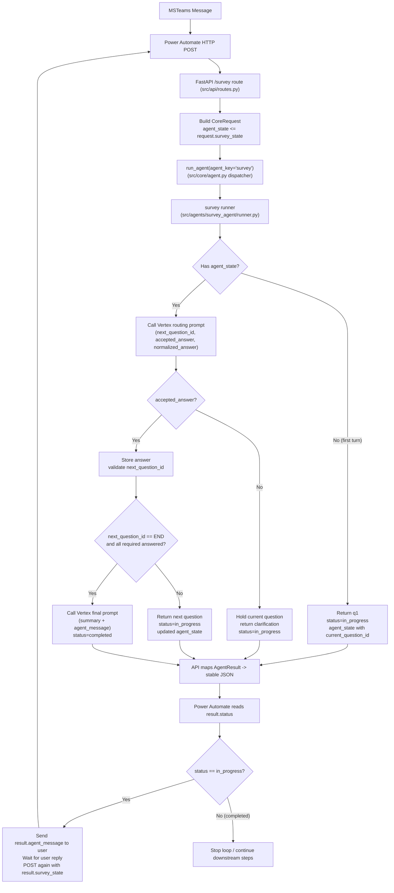

## Survey Agent Flow

```mermaid
flowchart TD
    A["MSTeams Message"] --> B["Power Automate HTTP POST"]
    B --> C["FastAPI /survey route (src/api/routes.py)"]

    C --> D["Build CoreRequest\nagent_state <= request.survey_state"]
    D --> E["run_agent(agent_key='survey')\n(src/core/agent.py dispatcher)"]
    E --> F["survey runner\n(src/agents/survey_agent/runner.py)"]

    F --> G{"Has agent_state?"}
    G -- "No (first turn)" --> H["Return q1\nstatus=in_progress\nagent_state with current_question_id"]
    G -- "Yes" --> I["Call Vertex routing prompt\n(next_question_id, accepted_answer, normalized_answer)"]

    I --> J{"accepted_answer?"}
    J -- "No" --> K["Hold current question\nreturn clarification\nstatus=in_progress"]
    J -- "Yes" --> L["Store answer\nvalidate next_question_id"]

    L --> M{"next_question_id == END\nand all required answered?"}
    M -- "No" --> N["Return next question\nstatus=in_progress\nupdated agent_state"]
    M -- "Yes" --> O["Call Vertex final prompt\n(summary + agent_message)\nstatus=completed"]

    H --> P["API maps AgentResult -> stable JSON"]
    K --> P
    N --> P
    O --> P

    P --> Q["Power Automate reads result.status"]
    Q --> R{"status == in_progress?"}
    R -- "Yes" --> S["Send result.agent_message to user\nWait for user reply\nPOST again with result.survey_state"]
    S --> B
    R -- "No (completed)" --> T["Stop loop / continue downstream steps"]
```
